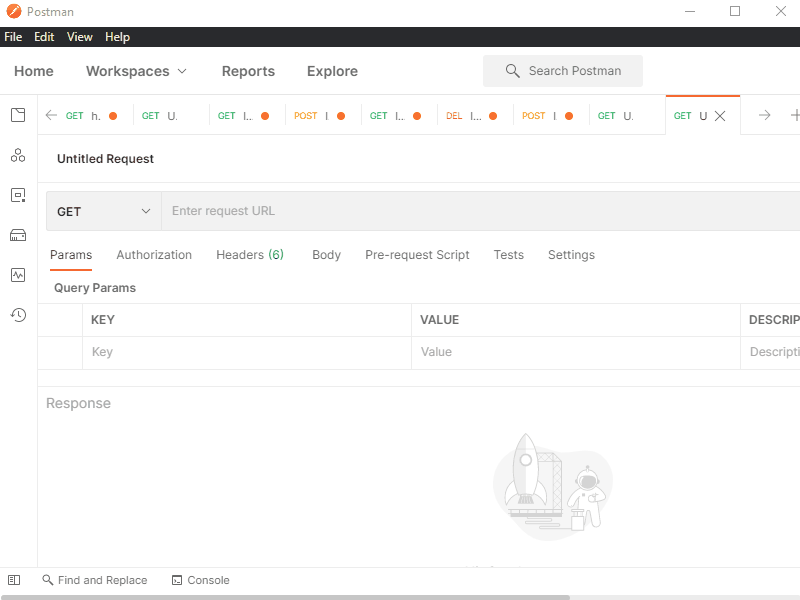

## ICS Student Council. Jam for Change

# Backend-API-Workshop

## Goals

- Concepts
  - REST API
  - GET/POST/DELETE HTTP requests
  - HTTP codes
  - JSON
  - Document-based NoSQL
  - Environment variables
- Tech
  - Node, Express
  - Mongoose, MongoDB
  - Postman

## Prerequisites for the workshop

- [Git](https://git-scm.com/downloads)
- [Vscode](https://code.visualstudio.com/)
- [Node v14](https://nodejs.org/en/download/)
- [Postman](https://www.postman.com/downloads/)
  - Don’t need make an account
- [Make a MongoDB account](https://www.mongodb.com/cloud/atlas/register)
- MongoDB Compass (~140 MB)
  - [Windows](https://downloads.mongodb.com/compass/mongodb-compass-1.25.0-win32-x64.exe)
  - [MacOs](https://downloads.mongodb.com/compass/mongodb-compass-1.25.0-darwin-x64.dmg)

## Why you should care about API

- Wanna authenticate with google? [API](https://developers.google.com/identity/protocols/oauth2)
- Wanna get yelp data to show in your app? [API](https://www.yelp.com/fusion)
- Wanna add paypal/credit card payment? [API](https://developer.paypal.com/docs/api/overview/)
- Wanna have a pokedex on demand? [API](https://pokeapi.co/)
- Wanna get a job? [API](https://www.glowtouch.com/importance-apis-business/#:~:text=APIs%2C%20or%20application%20program%20interfaces,programs%20are%20able%20to%20communicate.)

## Postman is kool



- Random Dogs API: [https://dog.ceo/api/breeds/image/random](https://dog.ceo/api/breeds/image/random)
- Dummy Data API: [http://dummy.restapiexample.com/api/v1/employees](http://dummy.restapiexample.com/api/v1/employees)
- Retrofitting RMP and Webreg API: [https://anteaterdeclassified.azurewebsites.net/api/RMPSummary?course=I%26C%20SCI%2033&instructor=Pattis,%20R.](https://anteaterdeclassified.azurewebsites.net/api/RMPSummary?course=I%26C%20SCI%2033&instructor=Pattis,%20R.)
- Pokedex: [https://pokeapi.co/api/v2/pokemon/pikachu](https://pokeapi.co/api/v2/pokemon/pikachu)
- HTTP Codes
  - 200: OK
  - 400: Client related errors
  - 500: Internal Server Error

## Example API workflows

- Frontend/client -> backend endpoint server -> data source
- Postman -> node/express -> mongodb
- Angular -> python/flask -> mySQL
- Postman -> dog api -> ???
- React -> Azure functions -> RMP endpoint server -> ???
- RAW html/Javascript -> AWS API Gateway w/ GraphQL -> AWS lambda -> AWS DynamoDB

## What we’re going to make

- Backend of a [LinkTree](httsp://linktr.ee) Clone
  - Allow you to create a page of links
  - Allow you to get a page of links
  - Allow you to delete a page of links
  - Allow you to add a link to a page
  - Allow you to delete a link in a page
- Tech stack
  - Backend endpoint server: Node+Express
  - Database: MongoDB

# Node + Express

- Creating a new project

  ```
  mkdir backend-workshop
  cd backend-workshop
  npm init  # when prompted, press enter a bigglion times
  ```

  - What is this `package.json`?

    ```
    {
        "name": "backend-api-workshop",
        "version": "1.0.0",
        "description": "",
        "main": "index.js",
        "scripts": {
            "test": "echo \"Error: no test specified\" && exit 1",
            "start": "nodemon server.js"
        },
        "repository": {
            "type": "git",
            "url": "git+https://github.com/Pursain/backend-api-workshop.git"
        },
        "author": "",
        "license": "ISC",
        "bugs": {
            "url": "https://github.com/Pursain/backend-api-workshop/issues"
        },
        "homepage": "https://github.com/Pursain/backend-api-workshop#readme",
        "dependencies": {
            "dotenv": "^8.2.0",
            "express": "^4.17.1",
            "mongoose": "^5.11.16",
            "nodemon": "^2.0.7"
        }
    }
    ```
  - `"dependencies"`: Allows us to add packages from other smart ppl made
    ```
    npm install some-node-packages
    ```
  - `"scripts"`: run any cool command line scripts you want to write 
    ```
    "scripts": {
        ...
        "dancing-parrots": "curl parrot.live"
        ...
    }
    ```
  - Install dependencies locally, similar to virtual env in python

- Installing Express
  ```
  npm install express
  ```
  - Express is a web framework
  - We’ll be using it to create API endpoints
- Creating the hello world endpoint
  TODO: GIF

  ````
  // importing the express module
  const express = require('express')

      // initializing the express framework
      const app = express()

      // registering an endpoint with express framework
      app.get('/', (req, res) => {
          res.send('Hello World!')
      })

      // allowing a port to access the express framework
      app.listen(3000, () => {
          console.log(`Example app listening at http://localhost:3000`)
      })
      ```

  ````

- Playing with Express
  TODO: GIF - Get request with a query param - GET `http://localhost:3000/canIGetSomeZots`

  ````
  app.get('/canIGetSomeZots', (req, res) => {
  console.log("GET /canIGetSomeZots", req.query)

              const zotNumber = req.query.zotNumber;

              let zotString = '';
              for (let i = 0; i < zotNumber; i++) {
                  zotString += 'Zot'
              }

              res.send(zotString);
          })
          ```
      - Post request with a body
      TODO: GIF

          - POST `http://localhost:3000/canIGetSomeZots`
          ```
          app.post('/canIGetSomeZots', (req, res) => {
              console.log("POST /canIGetSomeZots", req.body)

              const zotNumber = req.body.zotNumber;

              let zotString = '';
              for (let i = 0; i < zotNumber; i++) {
                  zotString += 'Zot'
              }

              res.send(zotString);
          })
          ```
  ````

# MongoDB

## Setting up MongoDB

1. Register for an account on MongoDB
2. Skip -> Build `M0 Cluster`
3. Create username password
4. Add your current IP address
5. Open the Mongodb Compass desktop app
6. Put in the connection URL with ur user and pwd
   - Connection urls are common way to allow you to connect to DBs

## Playing with MongoDB

1. Create database (linkTreeClone)
2. Holds a bunch of collections
3. Create collection (page)
   - Holds entries of data
4. Create some data
   - Mongo object automatically come with a unique id
   - Boba shops
   - Food spots
5. Query it in the shell
6. Find a page by the title
   - findOne(filter)
     - `db.page.findOne({title: “Boba shops”})`
7. Update the title of the page
   - findOneAndUpdate(filter, update)
     - `db.page.findOneAndUpdate({title: "Boba shops"}, {$set : {title: "Boba shops SO COOL"}})`
8. Add a link to a page
   - findOneAndUpdate(filter, update)
     - `db.page.findOneAndUpdate({title: "Boba shops"}, {$push: {links: "another link"}})`
9. Delete a page
   - findOneAndDelete(filter)
     - `db.page.findOneAndDelete({title: “Boba shops})`
10. Delete a link in a page
    - findOneAndUpdate(filter, update)
      - `db.page.findOneAndUpdate({title: "Boba shops"}, {$pull: {links: "another link"}})`

## Mongoose

- Allows node (javascript) to interact with the database (called an ODM)
  ```
  $ npm install --save mongoose
  ```

1. Create the connection
   ```
   $ npm install --save dotenv
   ```

- Why its important?

2. Create .gitignore
   - Make sure the connection string has the db name
3. Create the schema

   ```
   const mongoose = require('mongoose');

   const pageSchema = new mongoose.Schema({
       title: String,
       description: String,
       creator: String,
       links: [String]
   });

   const pageModel = mongoose.model('page', pageSchema);

   module.exports = pageModel;
   ```

# Connecting everything together

## Create the express route to create a page

```
POST /createPage
{title, creator, desc, links}
```

## Create the express route to get a page

```
GET /getPage?id=123
```

## Create the express route to delete a page

```
DELETE /deletePage?id=123
```

## Create the express route to add a link

```
POST /addLink?id=123
{link: 'yelp.com/omomo'}
```

## Create the express route to remove a link

```
POST /removeLink?id=123
{link: 123123}
```

# What's next?

- Middleware
- Cors
- Authentication
- Sessions
- Project structures (routers, services, mvc)
- Async/await vs callbacks
